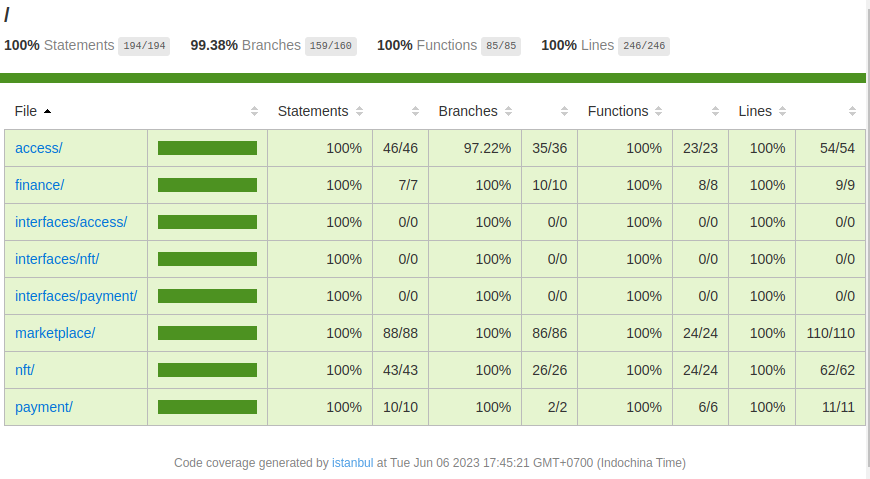

# finentic-protocol

Finentic is an open-source project based on Ethereum blockchain platform. This is also is the graduation project of a student at Dong A University, Vietnam. The project was conceived and implemented by Le Tuan Luc.


## Testing

```
npm i
npm run coverage
```




## Protocol


### Vietnamese Dong

Vietnamese Dong (VND) is a **fictional** fiat-backed stablecoin launched by the Finentic. VND is an ERC-20 token, the common currency of the Finentic platform specifically for the Vietnamese market. VND can be used for purchases on the Finentic Marketplace and converted from fiat currency via the Finentic Payment Gateway.


### Finentic Shared NFT

Finentic Shared NFT (FxNFT) is an ERC-721 token, extended with hashed metadata for each token, and unique and as a result, not interchangeable. Finentic Shared NFT allowing any creator to mint an NFT.


### Finentic Marketplace

Finentic Marketplace is an online non-fungible token (NFT) marketplace. The Finentic Marketplace offers a marketplace allowing for non-fungible tokens to be sold through an auction.


## Finentic contract deployment addresses

| Name               | Address                                                                                                                            |
| :----------------- | :--------------------------------------------------------------------------------------------------------------------------------- |
| ControlCenter      | [0x02177dbe73Df1E26fA1054082bD46584dCc56647](https://testnet.snowtrace.io/address/0x02177dbe73Df1E26fA1054082bD46584dCc56647#code) |
| VietnameseDong     | [0x189DEc993Cd001f2bEF5C251B68aE50B120834F0](https://testnet.snowtrace.io/address/0x189DEc993Cd001f2bEF5C251B68aE50B120834F0#code) |
| SharedNFT          | [0x9698e228156c81c46e79B55fab38aBe7Cb0bdAA7](https://testnet.snowtrace.io/address/0x9698e228156c81c46e79B55fab38aBe7Cb0bdAA7#code) |
| Collection         | [0xAC0a55753eFa6066d46d695f943385D980Fd8b64](https://testnet.snowtrace.io/address/0xAC0a55753eFa6066d46d695f943385D980Fd8b64#code) |
| CollectionFactory  | [0xac9f92B500792580D7C8FA019c69e60edfdA8d4d](https://testnet.snowtrace.io/address/0xac9f92B500792580D7C8FA019c69e60edfdA8d4d#code) |
| Treasury           | [0x8f6094C875179C9A7b4189363E7C7da5B265f024](https://testnet.snowtrace.io/address/0x8f6094C875179C9A7b4189363E7C7da5B265f024#code) |
| Marketplace        | [0x2d379507798B7Ec2b4311ed2de0e8dD4e2A465Df](https://testnet.snowtrace.io/address/0x2d379507798B7Ec2b4311ed2de0e8dD4e2A465Df#code) |


## License

This project is open-sourced software licensed under the GPL-3.0 License. See the LICENSE file for more information.